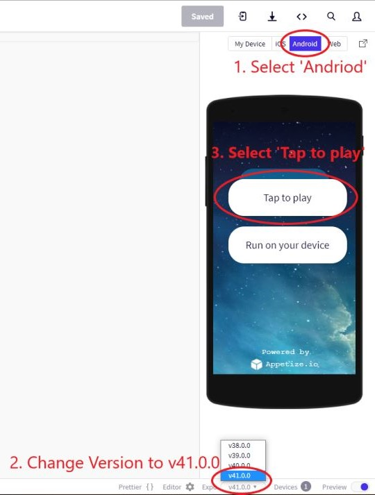

# Chatterbox

Chatterbox is a chat app for mobile devices built with React Native and developed using Expo.

The chat interface functionality is created with the Gifted Chat library. Chat conversations are stored locally with Google 
Firestore Database and Google Firebase authentication and are also accessible offline.

Users are able to share images (take a picture or choose from media library) once the user grants access to their local media library
and camera. Location sharing is enabled by the user granting the app permission to read user location data.

<!-- **See the hosted project on an Andriod Emulator [here](#online-android-emulator-setup).** -->


## Online Android Emulator Setup

Go to hosted project [here](https://snack.expo.io/@zeniagist/chatterbox).

1. Select 'Android'
2. Change version to v41.0.0
3. Select 'Tap to play'
- If device preview is at capacity wait in the queue. 
- ***An account is not required to view and run the app***

<!-- 

## Quick Start 🚀

### Install dependencies

Check if you are running the latest version of [Node](https://nodejs.org/en/).

Install [Expo](https://expo.io/) and create [your-Expo-account] (https://expo.io/signup) -->

```sh
$ npm install expo-cli --global
 ```

Set up your React Native App in your projects folder
```sh
$ expo init hello-world
```

Go to your project's directory 
```sh
$ cd hello-world
```

Launch the https server Metro Bundler in a new tab
```sh
$ npm run start
```
or
```sh
$ expo start
```
### Mobile Device Setup
- Install the Expo app through your device's app store (iOS or Android)
- Login with expo account
- Take a screenshot of the QR Code on the Metro Builder

### Device Emulator Setup
- If you would like to run the app on your machine through a simulator/emulator, you will either need
  - [Android Studio](https://docs.expo.io/workflow/android-studio-emulator/)
  - [iOS Simulator](https://docs.expo.io/workflow/ios-simulator/)

## Features
- Home page where users can enter their name and choose a background color for the chat screen
- Conversation page displaying the conversation
- Users can send images and location data 
- Datastorage online in firebase Cloud and local storage offline

## Technologies
- React Native
- Expo
- Google Firestore Database
- Gifted Chat library

### Author

[Zenia Gist](https://zeniagist.github.io)

### Version

1.0.0
